

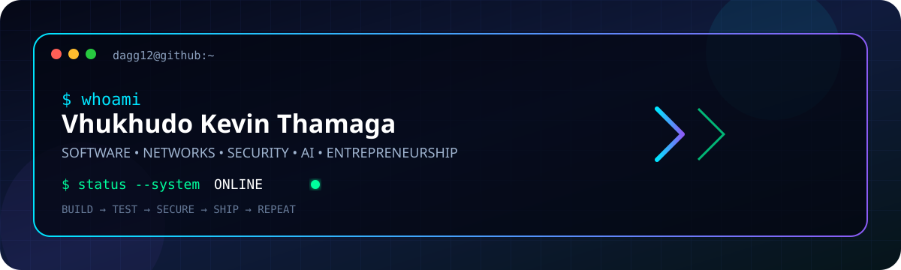

---

## ⚡ `whoami`

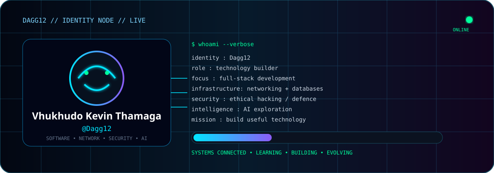

> **Vhukhudo Kevin Thamaga — Dagg12** 🇿🇦

I'm a software developer and technology builder working across **software, web applications, databases, networking, cybersecurity, artificial intelligence and entrepreneurship**.

I enjoy going beyond the code: understanding how an application connects to its data, how the network carries it, how security protects it, and how AI can make the solution smarter.

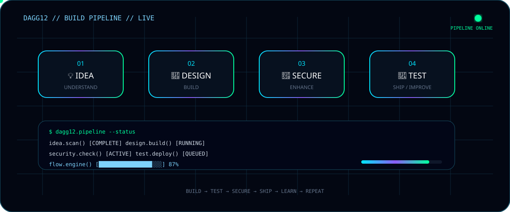

> **Build it. Understand it. Test it. Secure it. Improve it.**

---

## 🌌 My Technology Universe

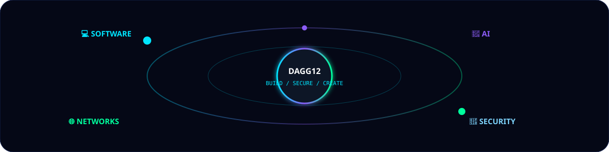

---

## 🧰 Technology Arsenal

### 💻 SOFTWARE

`Java` · `C#` · `C++` · `Python` · `JavaScript` · `SQL`

### 🌐 WEB

`HTML5` · `CSS3` · `JavaScript` · `React` · `Tailwind CSS`

### 🗄️ DATA

`MySQL` · `Oracle Database` · `Firebase` · `SQL` · `MySQL Workbench`

### 🛠️ TOOLS

`Git` · `GitHub` · `VS Code` · `Visual Studio` · `Linux` · `Cisco Packet Tracer`

---

## 🌐 Networking // Infrastructure

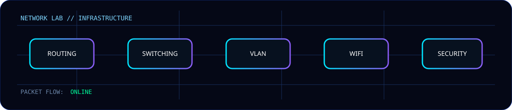

**IPv4 · Subnetting · Routing · Switching · VLANs · DHCP · DNS · WiFi · Mesh Networks · Network Design · Troubleshooting · Network Security**

I've used **Cisco Packet Tracer** for network design, configuration and troubleshooting involving routers, switches, VLANs, servers and wireless infrastructure.

---

## 🐉 Kali Linux // Ethical Hacking

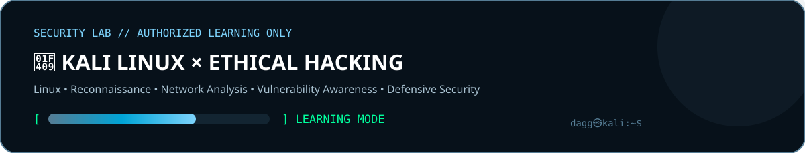 

I'm currently learning **Kali Linux and ethical hacking** as part of my cybersecurity development, with an attacker-awareness and defensive perspective.

**Exploring:** Linux & Command Line · Reconnaissance · Information Gathering · Network Analysis · Vulnerability Identification · Security Fundamentals · Ethical Hacking Methodologies · Security Testing Tools · Defensive Security.

> 🔐 **Ethical hacking is about understanding how systems can be attacked so they can be protected better.**
>
> All cybersecurity learning and testing is performed only in **authorised labs, personal environments and educational platforms**.

---

## 🤖 Artificial Intelligence // Exploring

Exploring AI for **software development, automation, intelligent applications, data analysis, cybersecurity, networking, design and problem solving**.

`🤖 AI APPLICATIONS` · `⚙️ AUTOMATION` · `🧠 INTELLIGENT SYSTEMS` · `🔐 AI + SECURITY` · `🌐 AI + NETWORKING` · `🎨 AI DESIGN`

---

## 📚 Learning Console

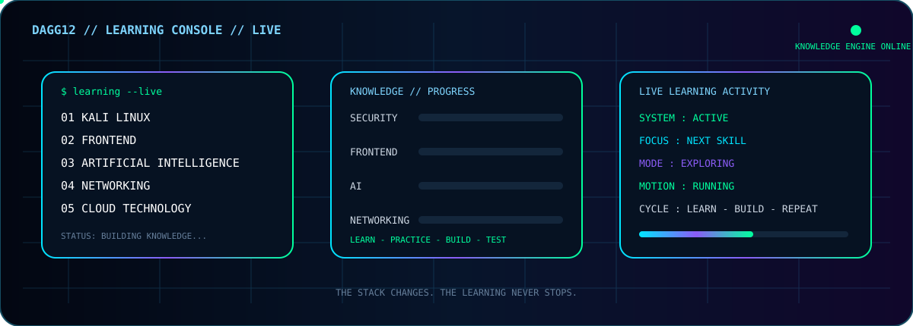

> **The stack changes. The learning never stops.** ⚡

---

## 🚀 Selected Builds

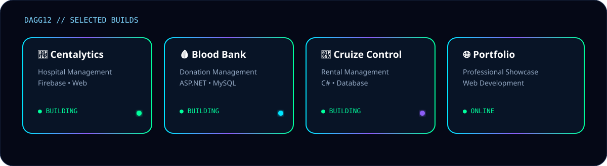

**🏥 Centalytics** — Hospital Management System · `HTML` `CSS` `JavaScript` `Firebase`  
[Repository](https://github.com/Dagg12/Centalytics) · [Live Application](https://centalytics-cef6c.web.app)

**🩸 Clinical Blood Bank** — Donation & hospital request management · `ASP.NET` `C#` `MySQL`  
[Repository](https://github.com/TeeCee07/ClinicalBloodBank)

**🚗 Cruize Control Rental Cars** — Vehicle rental & booking management · `C#` `Database Systems`  
[Repository](https://github.com/TeeCee07/CruizeControlRentalCars)

**🌐 Personal Portfolio** — Professional portfolio & digital showcase  
[Website](https://dagg12.github.io/Portfolio-Website/)

---

## 📡 THAMAS TECH WORLD

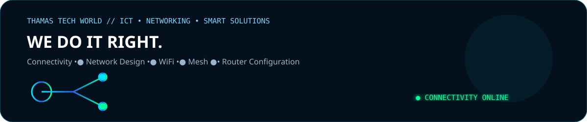

I am the **Co-Founder of THAMAS TECH WORLD**, a South African ICT and networking venture focused on practical connectivity and technology solutions.

**Business Portfolio:** https://dagg12.github.io/Thamas-portfolio/  
**Business Email:** Thamastechworld@gmail.com

---

## 😏 DAGGWORLD // IN DEVELOPMENT

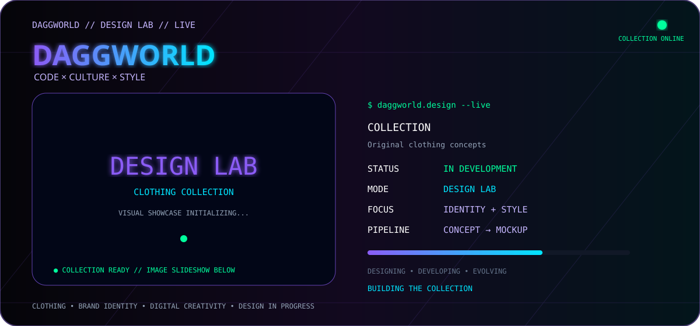

I am a **Core-Founder of DAGGWORLD**, a clothing and lifestyle brand currently being developed through design exploration, brand identity, clothing concepts and digital creativity.

> **Code. Create. Build. Wear Your Identity.**

---

## 📊 GitHub Command Center

  

---

## 🐍 Contribution Matrix

  `CONTRIBUTIONS` → `MOVEMENT` → `MOMENTUM`

---

## 🎮 Dagg12 Terminal // LIVE


  

---

## 🧭 Professional Direction

---

## 🤝 Let's Build Something

**SOFTWARE** · **NETWORKING** · **CYBERSECURITY** · **AI** · **DATABASES** · **ENTREPRENEURSHIP** · **CREATIVE TECHNOLOGY**

> **Different technologies. One goal: build something useful.**

---

## 📫 Contact / Links

  

---

### 💡 BUILD SOMETHING &nbsp; • &nbsp; 🧠 LEARN SOMETHING &nbsp; • &nbsp; 🚀 IMPROVE SOMETHING

**“Technology should simplify life — not complicate it.”**

**© 2026 Vhukhudo Kevin Thamaga • Dagg12**

